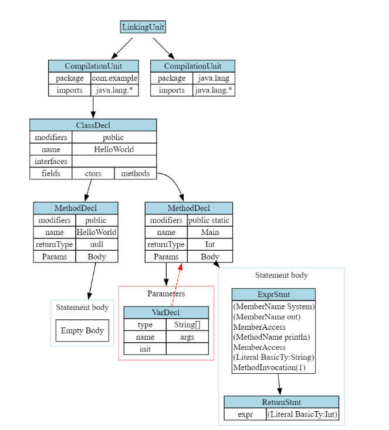

.. |nbsp| unicode:: 0x2007 0x2007
   :trim:
.. role:: dxc (emphasis)
   :class: dxc
.. role:: dxs (emphasis)
   :class: dxs

jcc1 Frontend Internals
================================================================================

Driver Program
--------------------------------------------------------------------------------

Parsing and Lexing
--------------------------------------------------------------------------------

The parser and lexer are built using Flex and Bison respectively. The grammar files are located under ``lib/grammar/*.l`` and ``*.y`` for the Flex and Bison files respectively. Some notes about our Flex lexer below. The accompanying ``joos1w_lexer_internal.h`` file contains the remainder + definition of the lexer class that Flex expects to be defined.

1. The Flex lexer is generated as a C++ class by the option ``%option c++ yyclass="Joos1WLexer"``. This allows the lexer to be re-entrant and not rely on global state.
2. Line and column location must be manually kept track of by ``YY_USER_ACTION`` macro
3. Each lexer rule creates a parse tree leaf node via the ``make_*()`` functions. Leaf nodes that are not intended to be part of a parse tree are poisoned to catch incorrect parser rules.
4. Since we're generating a C++ class, a Bison-compatible interface must be generated manually. See ``bison_lex`` under :dxc:`Joos1WLexer`.

Some notes about the Bison grammar file ``joos1w_parser.y``:

1. Grammar is written based off the JLS provided rules.
2. The Bison grammar is reentrant by declaring ``%define api.pure full``
3. The grammar file contains minimal code to construct the parse tree except in 2 cases:

   - A cast expression must be checked for validity
   - A literal number must be checked for range

   These cases exist as they could not be reasonably written into the parser rules. They were also not complex enough to warrant a place in the AST semantic checker.

Now we can talk about the parse tree design. Our parse tree lives under ``lib/parsetree/`` and is mainly defined by the :dxc:`parsetree::Node` class. Some notes about the tree:

1. The parse tree is untyped, allowing for simpler parser actions. This is desirable as Bison is really difficult to debug.
2. The basic structure of a parse tree is represented by the S-expression ``(NodeType child1 ... childN)``. However, leaf nodes will contain additional data, and so they are subclassed from :dxc:`parsetree::Node`.
3. Since the parse tree is untyped, it must be validated on-the-fly by the :dxc:`parsetree::ParseTreeVisitor` class. This visitor class is also responsible for generating the AST.

AST Construction and Design
--------------------------------------------------------------------------------

Design Philosophy
^^^^^^^^^^^^^^^^^^^^^^^^^^^^^^^^^^^^^^^^^^^^^^^^^^^^^^^^^^^^^^^^^^^^^^^^^^^^^^^^

The jcc1 AST nodes are designed to be mostly immutable once created. However, unlike Clang, we don't inherit most of the benifits from doing this, as we don't provide services such as a language server that requires tons of AST manipulation.

However, immutability is still nice to have and doesn't incur too much overhead. Fields that are designed to be mutated have a ``mut_`` prefix in their accessor. Immutability plays a significant role in ensuring safety and correctness.

The only mutation the AST undergoes is type resolution. Through resolution, all :dxc:`ast::UnresolvedType` nodes become resolved and will point to a corresponding :dxc:`ast::Decl` node.

Additionally, the AST is a purely data-based structure. It encodes no semantic information. For instance, class hierarchy information is not kept within the AST but must be queried from the `HierarchyChecker` pass.

Node Types
^^^^^^^^^^^^^^^^^^^^^^^^^^^^^^^^^^^^^^^^^^^^^^^^^^^^^^^^^^^^^^^^^^^^^^^^^^^^^^^^

All AST nodes inherit :dxc:`ast::AstNode`. There are four main categories of AST nodes. Their descriptions and relations are shown in the table below:

.. list-table::

  * - :fa:`chevron-right` :dxc:`ast::Type`
    - Contains resolver functions and equality comparisons

  * - |nbsp|:fa:`hand-o-right` :dxc:`ast::BuiltInType`
    - Represents a basic type like ``int`` and ``string`` literal

  * - |nbsp|:fa:`hand-o-right` :dxc:`ast::ArrayType`
    - Represents an unsized array of an arbitrary type
  
  * - |nbsp|:fa:`hand-o-right` :dxc:`ast::ReferenceType`
    - Represents a reference to an object, backed by the :dxc:`ast::ClassDecl` node
  
  * - |nbsp| |nbsp|:fa:`hand-o-right` :dxc:`ast::UnresolvedType`
    - An unresolved qualified identifier (a vector of strings called `parts`)

  * - :fa:`chevron-right` :dxc:`ast::Stmt`
    - Represents all statement nodes such as `For`, `If` and `While`

  * - :fa:`chevron-right` :dxc:`ast::Decl`
    - Represents all declarations are attached to a declaration context

  * - |nbsp|:fa:`chevron-right` :dxc:`ast::TypedDecl`
    - Represents a declaration with a type, ID and maybe an initializer

  * - |nbsp| |nbsp|:fa:`hand-o-right` :dxc:`ast::ValDecl`
    - A variable declaration has a lexical scope but no modifiers

  * - |nbsp| |nbsp|:fa:`hand-o-right` :dxc:`ast::FieldDecl`
    - A field declaration has an order, no lexical scope and modifiers

  * - |nbsp|:fa:`hand-o-right` :dxc:`ast::ClassDecl`
    - Represents a class

  * - |nbsp|:fa:`hand-o-right` :dxc:`ast::InterfaceDecl`
    - Represents an interface

  * - |nbsp|:fa:`hand-o-right` :dxc:`ast::MethodDecl`
    - Represents any method and constructor declaration

  * - :fa:`chevron-right` :dxc:`ast::DeclContext`
    - Has declarations attached to it, accessed through ``decls()``

  * - |nbsp|:fa:`hand-o-right` :dxc:`ast::ClassDecl`
    - See above.

  * - |nbsp|:fa:`hand-o-right` :dxc:`ast::InterfaceDecl`
    - See above.

  * - |nbsp|:fa:`hand-o-right` :dxc:`ast::MethodDecl`
    - See above.

  * - |nbsp|:fa:`hand-o-right` :dxc:`ast::CompilationUnit`
    - Represents CU, with package and imports

  * - |nbsp|:fa:`hand-o-right` :dxc:`ast::LinkingUnit`
    - Represents the entire program, all CUs linked together

In the table above, virtual classes are denoted by a :fa:`chevron-right` symbol, while concrete classes are denoted by a :fa:`hand-o-right` symbol.

Expression Representation
^^^^^^^^^^^^^^^^^^^^^^^^^^^^^^^^^^^^^^^^^^^^^^^^^^^^^^^^^^^^^^^^^^^^^^^^^^^^^^^^

Our expression representation is a bit unorthodox. Expressions are represented not as a tree but a linear array of expression nodes in reverse-Polish notation (RPN).

The :dxc:`ast::Expr` class contains a linked list container :dxc:`ast::ExprNodeList` of :dxc:`ast::ExprNode` nodes. Each node can be either an operator `ast::exprnode::ExprOp` or operand :dxc:`ast::exprnode::ExprValue`.

Any operation performed on expressions can then be done as a reduction on this array. An expression evaluator can be built by inheriting the :dxc:`ast::ExprEvaluator` and providing the reduction type.

This is a very natural way to represent expressions. For example, we can express type checking via rules such as ``int + int → int``, where the reduction value is an :dxc:`ast::Type`. So, an expression is correctly typed if and only if the evaluation succeeds.

Debugging the AST
^^^^^^^^^^^^^^^^^^^^^^^^^^^^^^^^^^^^^^^^^^^^^^^^^^^^^^^^^^^^^^^^^^^^^^^^^^^^^^^^

Finally, all of our AST nodes and data structures can be dumped to the console via the ``dump()`` function during debugging. This greatly reduces the complexity of debugging the compiler.

We also provide a DOT graph printer for the AST For a simple Joos1W program that prints out "Hello, World!":

.. code-block:: java

    package com.example;

    public class HelloWorld {
      public HelloWorld() {}
      public static int Main(String[] args) {
          System.out.println("Hello, World!");
          return 0;
        }
    }

The corresponding AST dumped looks like the image below. Note we have ommitted most of the standard library functions for brevity.

The red arrows in the AST represents an :dxc:`ast::Decl` being attached to its declaration context. The RPN expression array is also visualized (see the statements). Finally, the standard library functions are omitted purposefully from this screenshot, but they can be emitted with a command line argument in ``jcc1``.

Semantic Analysis
--------------------------------------------------------------------------------

There are 5 main passes of semantic analysis. We will go through them here.

During Initial AST Construction
^^^^^^^^^^^^^^^^^^^^^^^^^^^^^^^^^^^^^^^^^^^^^^^^^^^^^^^^^^^^^^^^^^^^^^^^^^^^^^^^

When the AST is being constructed from the parse tree, each AST node is constructed by a ``BuildXYZ`` method supplied by the :dxc:`ast::Semantic` class. This ensures that the AST node is allocated by the correct allocator and performs correctness checks on the AST's construction. For instance, modifier legality and lexical name conflicts are checked here.

At this stage, an implicit ``import java.lang.*`` is injected into each compilation unit (CU). This is required by the Java 1.3 Language Specification.

Since the AST is independent of lexical information, we keep track of lexical scoping by the :dxc:`ast::ScopeID` struct. This struct is endowed with a total order, that describes if one ``ScopeID x`` can view another ``ScopeID y``.

Name Resolution
^^^^^^^^^^^^^^^^^^^^^^^^^^^^^^^^^^^^^^^^^^^^^^^^^^^^^^^^^^^^^^^^^^^^^^^^^^^^^^^^

At this point, we have a complete AST. However, none of the :dxc:`ast::ReferenceType` nodes have been resolved. To resolve them, we must fill in the ``decl`` field to point to the class or interface declaration backing the type.

The name resolution semantic class builds a global package tree - a search tree of the canonical names of each type declared in the linking unit. Then, for each CU, an import map is built, mapping a specific simple name to a node in the package tree based on the CU's imports. This lets us resolve qualified type names.

Note the import and package tree information is not attached to the AST. Instead, the name resolution pass must be run, and its results queried by any dependent passes.

At this point, any standard library classes are also resolved, such as ``java.lang.Object`` and ``java.lang.String`` (and others).

Hierarchy Checking
^^^^^^^^^^^^^^^^^^^^^^^^^^^^^^^^^^^^^^^^^^^^^^^^^^^^^^^^^^^^^^^^^^^^^^^^^^^^^^^^

At this point, all types have been resolved. Now, we must check and validate the inheritance hierarchies. An inheritance map is built per class (or interface), defining the inherited members visible from each class (or interface).

Similarly to name resolution, the inherited members are not attached to the AST (to preserve immutability). Instead, they must be queried from this pass.

Expression Resolution and Type Checking
^^^^^^^^^^^^^^^^^^^^^^^^^^^^^^^^^^^^^^^^^^^^^^^^^^^^^^^^^^^^^^^^^^^^^^^^^^^^^^^^

Now we are ready to resolve simple and qualified names in the expressions. The :dxc:`semantic::ExprResolver` is responsible.

This is achieved by using expression evaluators. During resolution, an expression can reduce to a type union of:

#. A partially resolved identifier (:dxc:`semantic::internal::ExprNameWrapper`)
#. A resolved expression (:dxc:`ast::ExprNodeList`)
#. An unresolved expression atom (:dxc:`ast::ExprNode`)

This allows us to express the Java name resolution rules very cleanly. For instance, name classification rules often come in the form of ``Q . Id`` where if ``Q`` is a certain kind, then the entire ``Q . Id`` should be reclassified as another kind. With expression evaluators, we can idiomatically express this:

    Given the RPN ``Q . Id``, what should it reduce to?

It's immediately clear that ``Q`` must be our type union above and ``Id`` must be #3 above. Then, we simply proceed case-by-case according to the standard.

The expression resolution and type resolution passes are deeply intertwined. The :dxc:`semantic::ExprTypeResolver` is responsible for type resolution.

Type resolution determines resulting type of each operation (a subexpression) in the expression, and so the type of the entire expression as well. With type resolution, the expression evaluators let us perform "algebra" on the types. Each expression node has a type and if the types can be operated upon, then the expression is well-typed.

As you can see, expression evaluators are a unique approach that allows us to naturally express parts of the Java language specification.

Example resolution
~~~~~~~~~~~~~~~~~~~~~~~~~~~~~~~~~~~~~~~~~~~~~~~~~~~~~~~~~~~~~~~~~~~~~~~~~~~~~~~~

Consider this example:

.. code-block:: java

    // File: org/rpgpoet/Music.java
    package org.rpgpoet;
    public class Music {
        public static String wizards;
        public Music() {}
    }

    // File: bazola/Gabriel.java
    package bazola;
    public class Gabriel {
    	public static int n = org.rpgpoet.Music.wizards.length();
        public Gabriel() {}
    }

The initializer for ``Gabriel.n`` is parsed into the RPN expression:

.. code-block:: text

    (MemberName org)
    (MemberName rpgpoet)
    MemberAccess
    (MemberName Music)
    MemberAccess
    (MemberName wizards)
    MemberAccess
    (MethodName length)
    MethodInvocation(0)

After resolution, the expression is first re-linked to eliminate all member accesses to type nodes:

.. code-block:: text

    (MemberName wizards)
    MemberAccess
    (MethodName length)
    MethodInvocation(0)

Then, the expression node ``(MemberName wizards)`` is resolved to a :dxc:`ast::FieldDecl` node, and the expression node ``(MethodName length)`` is resolved to a :dxc:`ast::MethodDecl` node. These are stored in the ``decl`` field of the nodes.

Finally, the expression is type-resolved. The type resolver will assign a type to each of the node. The type of the entire expression is then the type of the last operator.

Final AST Validation
^^^^^^^^^^^^^^^^^^^^^^^^^^^^^^^^^^^^^^^^^^^^^^^^^^^^^^^^^^^^^^^^^^^^^^^^^^^^^^^^

Now, all expression identifiers and types have been resolved. The :dxc:`semantic::ExprStaticChecker` will then check that all static field accesses are legal and all member accesses are legal.

The final stage is to validate each statement is well formed. The :dxc:`semantic::AstChecker` will check this. For instance, the expression inside the condition of an ``if`` statement must be a boolean expression.

Diagnostics and Error Reporting
^^^^^^^^^^^^^^^^^^^^^^^^^^^^^^^^^^^^^^^^^^^^^^^^^^^^^^^^^^^^^^^^^^^^^^^^^^^^^^^^

